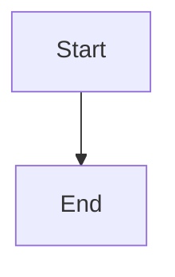
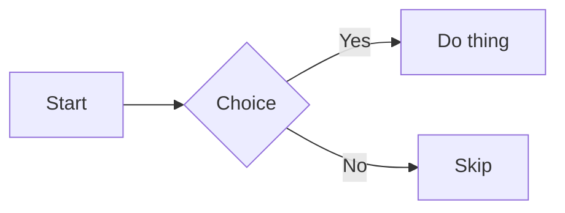
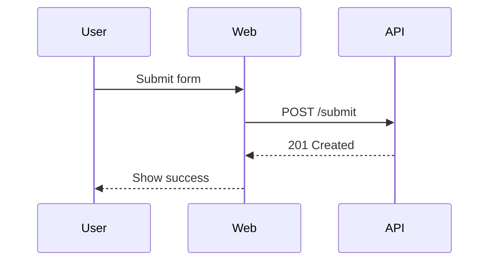
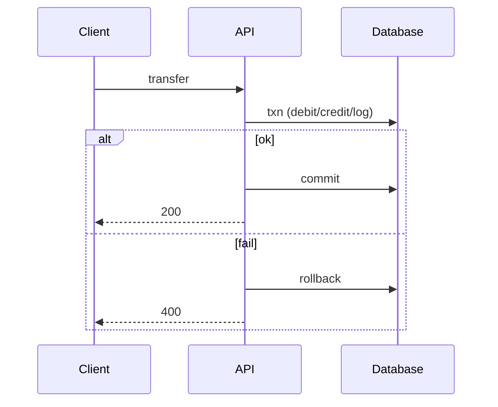
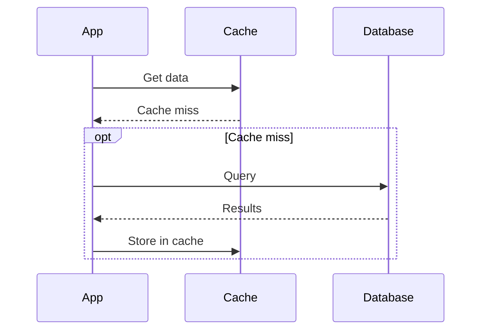
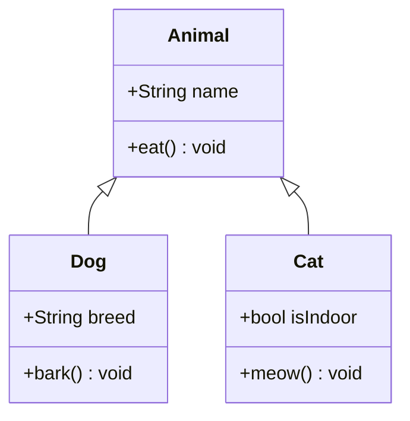

# 🧜‍♀️ pi-mermaid

Pi extension that renders Mermaid diagrams as ASCII in the TUI.

## Features
- Renders Mermaid blocks as ASCII diagrams inside Pi's TUI
- Collapsible output with source shown only on expand (ctrl+o)
- Token efficiently adds parser warnings/errors to LLM context
- Handles large blocks with safety limits and caching

## Install

```bash
pi install npm:pi-mermaid
```

Or, clone into your Pi extensions directory and enable it:

```bash
git clone https://github.com/Gurpartap/pi-mermaid ~/.pi/agent/extensions/pi-mermaid
```

After installing, enter `/reload` or restart Pi.

## Usage
Use Mermaid fenced blocks in chat:

````

````

Or render the last assistant message:

```
/pi-mermaid
```

## Examples
More examples: https://agents.craft.do/mermaid

````
Mermaid (ASCII)
 ┌───────┐     ┌────────┐     ┌──────────┐
 │       │     │        │     │          │
 │ Start ├────►│ Choice ├─Yes►│ Do thing │
 │       │     │        │     │          │
 └───────┘     └────┬───┘     └──────────┘
                    │
                    │
                    │
                   No
                    │
                    │         ┌──────────┐
                    │         │          │
                    └────────►│   Skip   │
                              │          │
                              └──────────┘


````

````
Mermaid (ASCII)
 ┌──────┐           ┌─────┐           ┌─────┐
 │ User │           │ Web │           │ API │
 └───┬──┘           └──┬──┘           └──┬──┘
     │                 │                 │
     │   Submit form   │                 │
     │─────────────────▶                 │
     │                 │                 │
     │                 │  POST /submit   │
     │                 │─────────────────▶
     │                 │                 │
     │                 │   201 Created   │
     │                 ◀╌╌╌╌╌╌╌╌╌╌╌╌╌╌╌╌╌│
     │                 │                 │
     │  Show success   │                 │
     ◀╌╌╌╌╌╌╌╌╌╌╌╌╌╌╌╌╌│                 │
     │                 │                 │
 ┌───┴──┐           ┌──┴──┐           ┌──┴──┐
 │ User │           │ Web │           │ API │
 └──────┘           └─────┘           └─────┘


````

````
Mermaid (ASCII)
 ┌────────┐      ┌─────┐                  ┌──────────┐
 │ Client │      │ API │                  │ Database │
 └────┬───┘      └──┬──┘                  └─────┬────┘
      │             │                           │
      │  transfer   │                           │
      │─────────────▶                           │
      │             │                           │
      │             │  txn (debit/credit/log)   │
      │             │───────────────────────────▶
      │             │                           │
  ┌alt [ok]─────────────────────────────────────────┐
  │   │             │                           │   │
  │   │             │          commit           │   │
  │   │             │───────────────────────────▶   │
  │   │             │                           │   │
  │   │     200     │                           │   │
  │   ◀╌╌╌╌╌╌╌╌╌╌╌╌╌│                           │   │
  │   │             │                           │   │
  ├[fail]╌╌╌╌╌╌╌╌╌╌╌╌╌╌╌╌╌╌╌╌╌╌╌╌╌╌╌╌╌╌╌╌╌╌╌╌╌╌╌╌╌╌╌┤
  │   │             │                           │   │
  │   │             │         rollback          │   │
  │   │             │───────────────────────────▶   │
  │   │             │                           │   │
  │   │     400     │                           │   │
  │   ◀╌╌╌╌╌╌╌╌╌╌╌╌╌│                           │   │
  │   │             │                           │   │
  └─────────────────────────────────────────────────┘
      │             │                           │
 ┌────┴───┐      ┌──┴──┐                  ┌─────┴────┐
 │ Client │      │ API │                  │ Database │
 └────────┘      └─────┘                  └──────────┘


````

````
Mermaid (ASCII)
  ┌─────┐            ┌───────┐  ┌──────────┐
  │ App │            │ Cache │  │ Database │
  └──┬──┘            └───┬───┘  └─────┬────┘
     │                   │            │
     │     Get data      │            │
     │───────────────────▶            │
     │                   │            │
     │    Cache miss     │            │
     ◀╌╌╌╌╌╌╌╌╌╌╌╌╌╌╌╌╌╌╌│            │
     │                   │            │
 ┌opt [Cache miss]────────────────────────┐
 │   │                   │            │   │
 │   │             Query │            │   │
 │   │────────────────────────────────▶   │
 │   │                   │            │   │
 │   │            Results│            │   │
 │   ◀╌╌╌╌╌╌╌╌╌╌╌╌╌╌╌╌╌╌╌╌╌╌╌╌╌╌╌╌╌╌╌╌│   │
 │   │                   │            │   │
 │   │  Store in cache   │            │   │
 │   │───────────────────▶            │   │
 │   │                   │            │   │
 └────────────────────────────────────────┘
     │                   │            │
  ┌──┴──┐            ┌───┴───┐  ┌─────┴────┐
  │ App │            │ Cache │  │ Database │
  └─────┘            └───────┘  └──────────┘


````

````
Mermaid (ASCII)
 ┌───────────────┐
 │ Animal        │
 ├───────────────┤
 │ +name: String │
 ├───────────────┤
 │ +eat: void    │
 └───────────────┘
         △
         └──────────────────────┐
          │                     │
 ┌────────────────┐    ┌─────────────────┐
 │ Dog            │    │ Cat             │
 ├────────────────┤    ├─────────────────┤
 │ +breed: String │    │ +isIndoor: bool │
 ├────────────────┤    ├─────────────────┤
 │ +bark: void    │    │ +meow: void     │
 └────────────────┘    └─────────────────┘


````

## License
MIT © 2026 Gurpartap Singh (https://x.com/Gurpartap)
