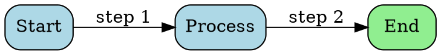

# @walterra/pi-graphviz

Graphviz DOT diagram extension for [pi coding agent](https://github.com/badlogic/pi-mono) - render diagrams as inline terminal images.

## Installation

```bash
pi install npm:@walterra/pi-graphviz
```

This installs the package globally and adds it to your pi settings.

## Features

- **DOT Language**: Full support for Graphviz DOT syntax
- **Auto Install**: Graphviz auto-installed via brew (macOS) or apt/dnf (Linux)
- **Multiple Engines**: dot, neato, fdp, circo, twopi layout engines
- **Inline Display**: Diagrams render directly in terminals supporting inline images
- **SVG/PNG Output**: Save diagrams in either format

## Tool: `graphviz_chart`

Renders a Graphviz DOT specification as a PNG image.

### Parameters

| Parameter   | Type   | Required | Description                                            |
| ----------- | ------ | -------- | ------------------------------------------------------ |
| `dot`       | string | ✅       | Graphviz DOT specification                             |
| `engine`    | string |          | Layout engine: dot (default), neato, fdp, circo, twopi |
| `width`     | number |          | Output width in pixels                                 |
| `height`    | number |          | Output height in pixels                                |
| `save_path` | string |          | Optional file path (.png or .svg)                      |

### Example



## Use Cases

- Architecture diagrams
- Flowcharts
- State machines
- Dependency graphs
- ER diagrams
- Network topologies

## Reference Documentation

See [graphviz-reference.md](./extensions/graphviz-chart/graphviz-reference.md) for documentation on:

- DOT language syntax
- All node shapes and edge styles
- Clusters and subgraphs
- Layout engines
- Professional theming
- Common patterns

## License

MIT
